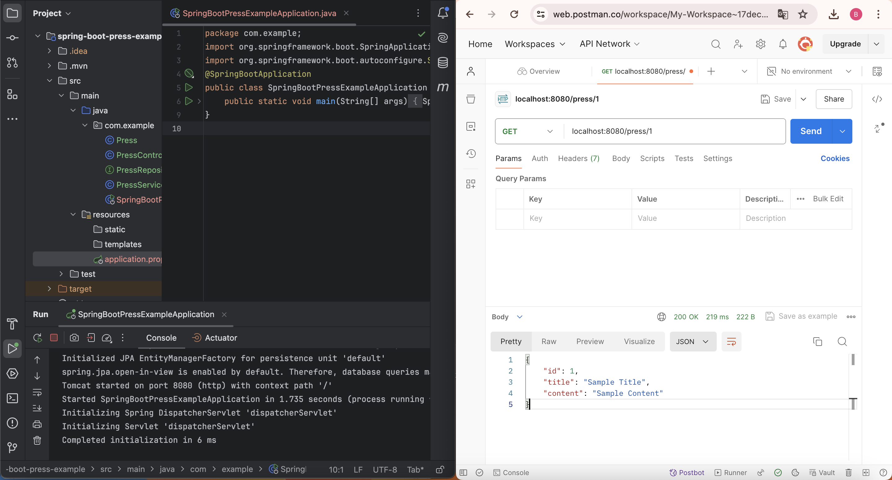

# wk3-rest-crud
https://www.cainiaojc.com/springboot/springboot-rest-example.html

RESTful and CRUD are two network communication standards, for frontend and for the database respectively. Now write a REST interface and verify by [Postman](https://web.postman.co/workspace/My-Workspace~17dec501-2190-4fb7-8a43-d6953248e8f0/request/create?requestId=9d501966-0a07-471c-ae0f-5ca786e0ff62): pre-store an article with id=1 in the database so that when you use a get request to access localhost:8080/press/1, the article data can be returned in .json format. As followed by the Fig.1-2 below.

    
    
Fig.1 REST

    
    
Fig.2 Press

